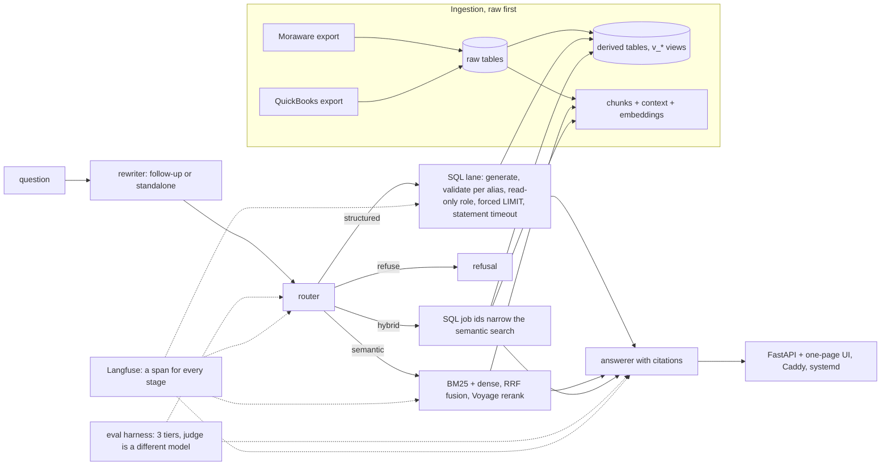

# EMG RAG

[](https://github.com/SanyaBoroda4/emg-rag-public/actions/workflows/tests.yml)

Natural-language questions over a countertop fabricator's job-tracking
(Moraware) and invoicing (QuickBooks) data, answered with cited evidence: the
SQL that ran and its rows, or the note chunks the answer rests on. Live for
the company's office behind HTTPS and Basic Auth, with follow-up questions,
per-user history and feedback.


*Mock data: every screenshot in this repo shows invented fixtures, not
company records.*

## Architecture



## Results

Two full eval runs at commit `a070597` on 2026-09-21
(`evals/results/2026-09-21-1359-wo20-full3.json`, `2026-09-21-1411-wo20-full4.json`)
and the reports named per row.

| measure | value | source |
|---|---|---|
| routing accuracy, 82 questions | 96.3% | run JSONs, `tier1.accuracy` |
| generation judged correct | 75 of 82 in both runs; measured judge floor ±1 | run JSONs, `tier3.correct`; `evals/results/wo14_count_skip_judge.md` |
| faithfulness | 0.962 and 0.924 | run JSONs, `tier3.faithfulness` |
| reranked recall@10 / MRR | 0.818 / 0.660 | run JSONs, `tier2.reranked` |
| conversation tier, follow-up turns correct | 16–17 of 19 across four runs; standalone turns passed through byte-identical 19 of 19 every run; all 38 turns draft, verified 0 | `evals/results/wo20_correctness.md`, §8 |
| cost and wall time per full run | $1.04 / 605 s and $1.07 / 701 s, one worker | run JSONs, `meta` |
| `sql_execute` p95 | 0.20 s (median 0.03 s) | `evals/results/wo14_count_skip_judge.md` |

Method: 82 golden questions by the domain owner (55 verified, 27 draft; 53
structured, 23 semantic, 3 hybrid, 3 refuse) and 15 conversations of 38
turns. Tier 1 scores the route, tier 2 retrieval against gold chunk ids,
tier 3 the answer against the key: numeric match for SQL rows, otherwise a
Claude Sonnet judge, while Haiku answers. Router, SQL and answer run at
temperature 0, so run-to-run movement is the judge's, and a change counts
only when it moves the failing set.

## Six engineering decisions

**Routing to lanes, not one retriever.** A count and a "what did the note
say" need different machinery. A Haiku router picks structured, semantic,
hybrid or refuse, and the eval scores the route separately from the answer
(96.3%), so each lane's failures are fixable on their own.
`evals/results/wo9_status_widening.md`, `evals/results/wo16_serving.md`.

**SQL-lane safety layers.** One parsed SELECT over whitelisted views, every
column checked against the view its alias names, a forced `LIMIT 200`, a
read-only role, a 10 s statement timeout. The per-alias check was added
after `j.customer` on the wrong alias passed the old global whitelist; it
still accepts all 116 queries the model wrote in two earlier full runs.
`retrieval/sql_lane.py`, `tests/test_sql_validator.py`, `evals/results/wo20_correctness.md`.

**A hybrid two-stage path.** "Which quartzite jobs stalled after quote, and
what did the notes say" runs the SQL first and restricts retrieval to the
returned job ids, so the notes come from the right nine jobs rather than the
nine most similar notes anywhere. `retrieval/pipeline.py`, Q30 in
`evals/results/wo20_correctness.md`.

**A rerank API instead of a local model on a 2 GB box.** The box also runs
live production containers. A local cross-encoder failed the 400 MiB memory
gate at 593 MiB peak, and torch on the box makes `import voyageai` pull about
430 MiB into every process, so the server uses the Voyage rerank API.
`HANDOFF.md` (server constraints), `scripts/measure_reranker.py`.

**Rewrite before routing.** A follow-up becomes one self-contained question
in front of the unchanged pipeline, or passes through byte-identical, so a
single question stays a pure function of one string and every eval keeps its
determinism. Follow-ups correct went from 1 of 20 to 15–16 of 18, with all
standalone turns unchanged. `docs/wo17-conversational-followups-report.md`.

**Measure the judge instead of voting.** Sonnet takes no sampling knobs, so
nine independent judge passes ran on one saved answer set: 74–76 of 82, one
row at 5 ✓ / 4 ✗, and majority-of-3 still flipped it. The floor is stated
(±1) and only a change in the failing set counts.
`evals/results/wo14_count_skip_judge.md`.

**Tracing found the slow query.** `sql_execute` had a 0.03 s median and a
1.96 s p95, a 60× spread; all five slow spans were one view, EXPLAIN pointed
at a correlated subquery, and one 184 kB partial index took it from 1,167 ms
to 326 ms with identical output. `evals/results/wo13_determinism_slow_sql.md`.

## What does not work yet

- **Over-inclusion:** three scoped "is there a job like X" questions (Q45,
  Q47, Q49) stay red because the answerer generalises from a sample
  (`evals/results/wo11_rekey.md`).
- **SQL-text jitter:** Q68 and Q76, and one conversation turn, flip between
  runs on the wording of the generated SQL (`evals/results/wo20_correctness.md`).
- **The material parser:** `material_name` is free text with slab counts,
  thickness and finish embedded; Q11 stays red until it is parsed into
  columns (`docs/OPERATING_NOTES.md`).

## Cost of the build

**$28.41** of API spend recorded inside the 43 eval run files, and
**≈ $35.61** by adding each work order's own cost section through WO19.
Both sums, the method and what is not counted: `docs/COST_LEDGER.md`.

## Limitations

One company's data, a snapshot as of 2026-07-30, loaded once. Basic Auth
behind Caddy for the office only. Two questions in flight, 60 s per
question, 500 characters per question: sized for an office, not for load.

## Repository

```
ingest/     raw loaders, derived tables, chunking, contextualisation, embeddings
sql/        idempotent, append-only migrations
retrieval/  router, SQL lane, BM25 + dense + fusion + rerank, rewriter, answerer, tracing
serve/      FastAPI app and the one-page UI
evals/      golden set, conversations, harness, judge, results, reports
scripts/    CLI query, verification gates, public-mirror tooling
tests/      rewriter fixtures, SQL validator, public-mirror guard
docs/       engineering notes, operating notes, reports, demo script, facts sheet, cost ledger
```

Unit tests need no API key and no database:

```
pip install -r requirements.txt
python tests/test_rewrite.py && python tests/test_sql_validator.py && python tests/test_public_guard.py
```

The eval tiers need keys and a database: `python evals/run_eval.py --workers 4`
(about four minutes and $1 per run; `docs/OPERATING_NOTES.md`). The story of
every phase: `docs/ENGINEERING_NOTES.md`. Project rules: `CLAUDE.md`.

This is the sanitised public mirror of a private repository: employee names
are pseudonyms, customer data and company dollar figures are redacted, and
the eval run files with retrieved note text stay private
(`docs/wo19_public_audit.md`).
