# WO18 — Restyle the web UI: dark console

Baseline `2b9c5fb` (WO17). One file restyled in place (`serve/static/index.html`),
four woff2 files added under `serve/static/fonts/`, one static route added to
`serve/app.py` so the browser can fetch them. No migrations, no API changes, no
pipeline code touched. Service restart is Alex's step.

## 1. Plan (written before the first edit)

### 1.1 Tokens

Defined once on `:root`; nothing in the stylesheet uses a literal colour outside
this table except the four route hues, which are also tokens.

| Token | Value | Used for |
|---|---|---|
| `--bg` | `#0F1419` | page background, evidence terminal inset |
| `--bg-raised` | `#151B22` | sidebar, answer cards, notes cards, question field |
| `--line` | `#232C36` | every border; there are no shadows |
| `--text` | `#D7DEE5` | prose, questions, answers, table cells |
| `--text-dim` | `#7C8894` | meta (latency, cost, timestamps), header sentence, placeholder |
| `--accent` | `#22D3EE` | focus ring, Ask button, links, structured tag, SQL keywords, table header rule |
| `--accent-dim` | `#0E7490` | the `sql ›` prompt glyph, in-flight button fill |
| `--danger` | `#F87171` | errors, timeout, failed turns, the failed tag |
| `--r-semantic` | `#A78BFA` | semantic route tag |
| `--r-hybrid` | `#34D399` | hybrid route tag |
| `--r-refuse` | `#FBBF24` | refuse route tag |

Contrast, WCAG relative luminance, computed before the edit:

| Foreground | on `--bg` #0F1419 | on `--bg-raised` #151B22 |
|---|---|---|
| `--text` | 13.64 | 12.77 |
| `--text-dim` | 5.12 | 4.79 |
| `--accent` | 10.24 | 9.59 |
| `--danger` | 6.69 | 6.27 |
| `--r-semantic` | 6.80 | 6.37 |
| `--r-hybrid` | 9.63 | 9.01 |
| `--r-refuse` | 11.09 | 10.38 |
| `--accent-dim` | 3.46 | 3.23 |

Every text colour clears 4.5:1. `--accent-dim` does not, so it is never used
for text: it is the decorative `sql ›` glyph (aria-hidden) and the in-flight
button fill, on which the label is `--bg`.

Type: IBM Plex Sans (Regular 400, Medium 500) for questions, answer prose, note
text, buttons, sidebar titles. IBM Plex Mono (Regular, Medium) for anything that
is data: latency/cost, SQL, the rows table, chunk and job ids, timestamps, the
"Interpreted as" line, the seconds counter, numbers inside answer prose. Base
15px, SQL and tables 13px, title 20px/500. Answer prose max 72ch. Sentence case
everywhere, no uppercase labels, no middle-dot separators.

### 1.2 Wireframes

Idle:

```
┌─ 280px ─────────────┬──────────────────────────────────────────────────────┐
│ Conversations       │ EMG RAG                                              │
│                     │ Data as of 2026-07-30. Answers cite job and chunk ids.│
│ How much did we     │                                                      │
│ invoice in 2024?    │ [How much did we invoice in 2024?] [Jobs in Mount…]  │
│ 2026-09-21 09:12    │ [Crew J installs H1 2026] [wasted templates] [conversion]│
│ 3 turns  structured │                                                      │
│                     │ ┌────────────────────────────────────────────────┐   │
│ Were there jobs …   │ │ Ask about jobs, quotes, templates, installs…   │   │
│ 2026-09-20 16:40    │ │                                                │   │
│ 1 turn   semantic   │ └────────────────────────────────────────────────┘   │
│                     │ [ Ask ]  New conversation                            │
│ What is the meaning │                                                      │
│ of life?  (dimmed)  │                                                      │
│ 2026-09-19 11:05    │                                                      │
│ 1 turn   failed     │                                                      │
│ timed out after 60 s│                                                      │
│                     │                                                      │
│ Load more           │                                                      │
└─────────────────────┴──────────────────────────────────────────────────────┘
```

In flight (field and button disabled; button filled with accent; mono counter):

```
│                     │ ┌────────────────────────────────────────────────┐   │
│                     │ │ How much did we invoice in 2024?               │   │
│                     │ └────────────────────────────────────────────────┘   │
│                     │ [█Ask█]  New conversation   working… 4 s             │
```

Answered, structured, evidence open by default (the one bold element):

```
│                     │ ┌─ card, --bg-raised, hairline ───────────────────┐  │
│                     │ │ How much did we invoice in 2024?                │  │
│                     │ │ structured   4.2 s   $0.0192           (mono)   │  │
│                     │ │                                                 │  │
│                     │ │ We invoiced $[redacted] in 2024 across 1,598  │  │
│                     │ │ invoices. That is 13.5% more than 2023 …        │  │
│                     │ │                                                 │  │
│                     │ │ ▾ Evidence   sql   notes (2)                    │  │
│                     │ │ ┌─ --bg inset ────────────────────────────────┐ │  │
│                     │ │ │ sql › SELECT date_trunc('year', invoice_date)│ │  │
│                     │ │ │       FROM v_invoices                        │ │  │
│                     │ │ │       WHERE invoice_date >= DATE '2023-01-01'│ │  │
│                     │ │ │       GROUP BY 1 ORDER BY 1                  │ │  │
│                     │ │ │ showing 4 of 4 rows                          │ │  │
│                     │ │ │ year         invoices     invoiced_usd       │ │  │
│                     │ │ │ ────────────────────────────────── (accent)  │ │  │
│                     │ │ │ 2023-01-01      1412       $[redacted]        │ │  │
│                     │ │ │ 2024-01-01      1598       $[redacted]        │ │  │
│                     │ │ └─────────────────────────────────────────────┘ │  │
│                     │ │ Was this useful?  [👍] [👎]                       │  │
│                     │ └─────────────────────────────────────────────────┘  │
```

### 1.3 What would make this look like every other dark dashboard, and what is different

The generic version is easy to picture: a near-black background with a subtle
gradient, cards floating on drop shadows, a rainbow of filled status pills, a
tracked-out uppercase "EVIDENCE" eyebrow, a glowing focus ring, a skeleton
shimmer while loading, numbers in big KPI tiles, and Inter everywhere. Every
observability SaaS ships that page, and it reads as "product", not "tool".

What is different here: the base is slate rather than black and there is exactly
one saturated colour, so the eye is not managed by the palette. Nothing floats:
hairlines only, no shadows, no gradients, no glow. Text is sentence case with
plain sentences instead of labels. The only place the page spends any boldness
is the evidence panel, which opens by default for structured and hybrid answers
and is drawn as a terminal block inset into the card: a `sql ›` prompt, tinted
keywords, a mono rows table with right-aligned digits and one accent rule under
the header. The numbers in the answer sentence use the same mono face as the
table, so the reader's eye connects the claim to the rows. That is the page's
one argument: you can see why.

Two motions only, both caused by the user: the mono seconds counter while a
question runs and a 150 ms fade when the answer card lands. Nothing on hover,
nothing on load, and `prefers-reduced-motion` turns both off.

## 2. What changed

Three places, one commit.

**`serve/static/index.html`** (17,452 → 21,214 bytes). The stylesheet is
rewritten from scratch against the token table; there is no literal colour
outside `:root`. The markup changed in four spots: the `color-scheme` meta, the
header sentence, the sidebar heading ("Conversations") and the drawer button
label, and the in-flight counter markup (a wrapper span so reduced-motion can
hide the seconds). The JavaScript is the WO17 code with these rendering-only
edits, each required by the direction:

| Edit | Why |
|---|---|
| `details` gets the `open` attribute when the route is structured or hybrid | evidence open by default |
| `nums()` wraps digit runs in answer prose in `<span class="n">` (mono) | numbers in the sentence match the rows table |
| `sqlHtml()` wraps SQL keywords in `<span class="kw">` (accent) | tinted keywords in the terminal block |
| numeric columns get `class="n"` on `th`/`td` (a column is numeric if any row holds a JS number) | right-aligned digits |
| error cards get `class="card failed"` | failed turns greyed |
| separator text: " · " between latency and cost, in the sidebar line and in the note-card header is gone (flex gap or spaces instead); the conversation note is a sentence; tab labels are lowercase; "Interpreted as" uses a span instead of `<i>` | sentence case, no middle dots |
| `askBtn` gets `class="busy"` while in flight | the button fills only then |

Removed from the old page: the spinning ring before "working…", the 200 ms drawer
slide, the drawer's box shadow, uppercase tracked route pills, the rounded
blue Ask button, and the "follow-ups welcome" tail on the header line.

**`serve/static/fonts/`** (new): four woff2 files, Latin-1 subsets from the
`@ibm/plex-sans` 1.1.0 and `@ibm/plex-mono` 2.5.0 npm packages (fetched from
jsDelivr on 2026-09-21), plus IBM's `LICENSE.txt`. Font loading is
`font-display: swap`; the fallback stacks are system sans and system mono.

**`serve/app.py`** (+5 lines): one import and one line mounting
`/static/fonts` with Starlette's `StaticFiles`. Without it the browser would
404 on the woff2 files, because the old app served exactly one file. This is a
new GET route for static files, not an API change; nothing else under
`static/` is exposed and no endpoint's behaviour changed.

Not touched: any pipeline module, the SQL, the rewriter, the evals.

## 3. Screenshots, before and after

All from local Chrome against a stdlib mock of the five endpoints (the server
has no browser and 193 MB free; nothing was installed). **Every screenshot
shows mock data**: the job names, notes, invoice figures and conversations in
them are invented fixtures from the mock, not EMG records. Desktop frames are
1280 px wide, captured at 0.6 scale; phone frames are a same-origin 380 × 800
iframe at 0.7 scale. Files live in `evals/results/wo18_screens/`.

| State | Before | After |
|---|---|---|
| Idle, sidebar with three conversations (one failed) | 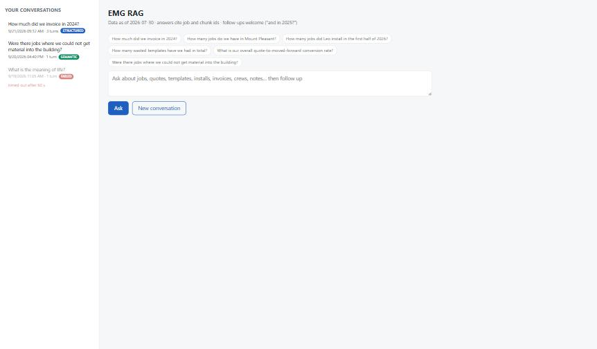 | 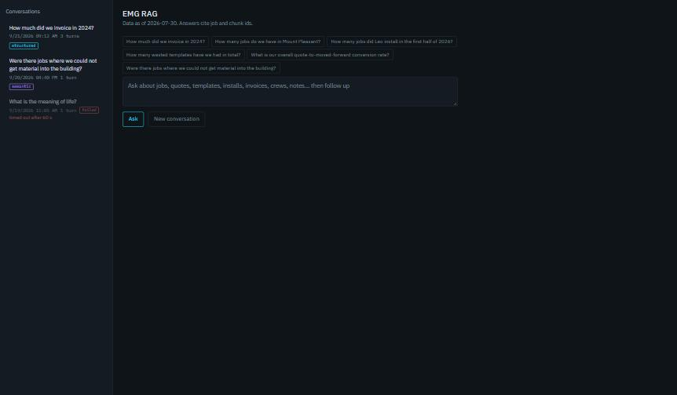 |
| In flight (field disabled, Ask filled, "working… 4 s") | not captured | 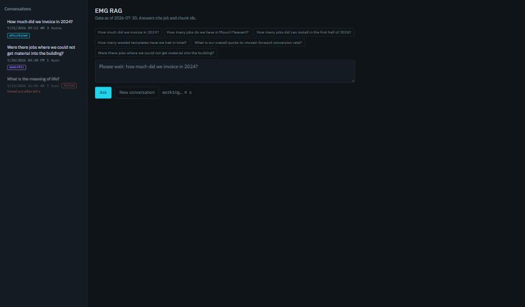 |
| Structured answer, evidence open, SQL + rows | 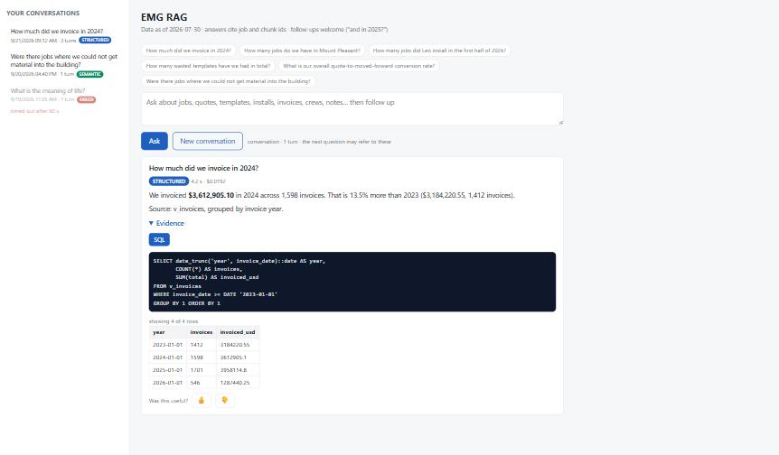 | 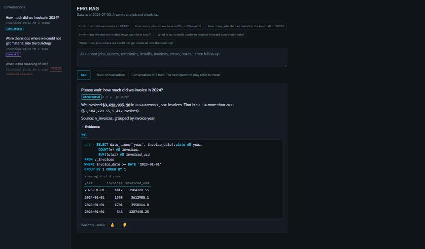 |
| Semantic answer (evidence collapsed by default) | 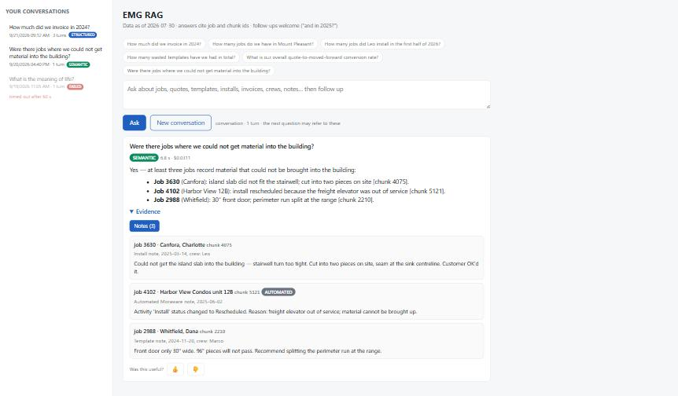 | 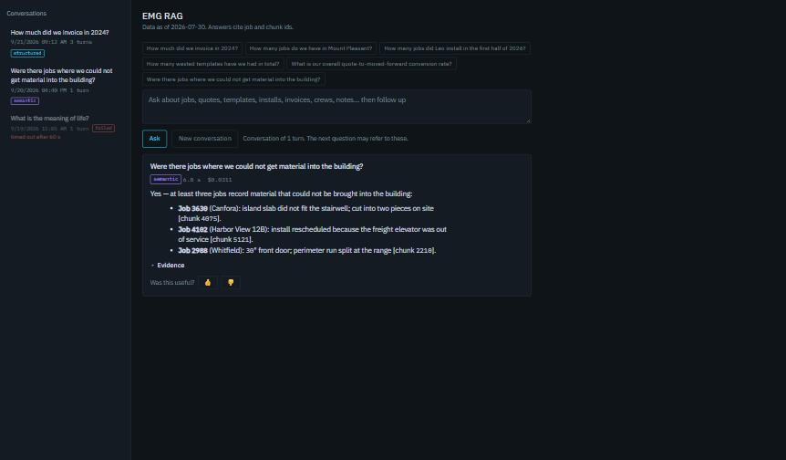 |
| Semantic, notes open, thumbs-down comment box | (same before frame) | 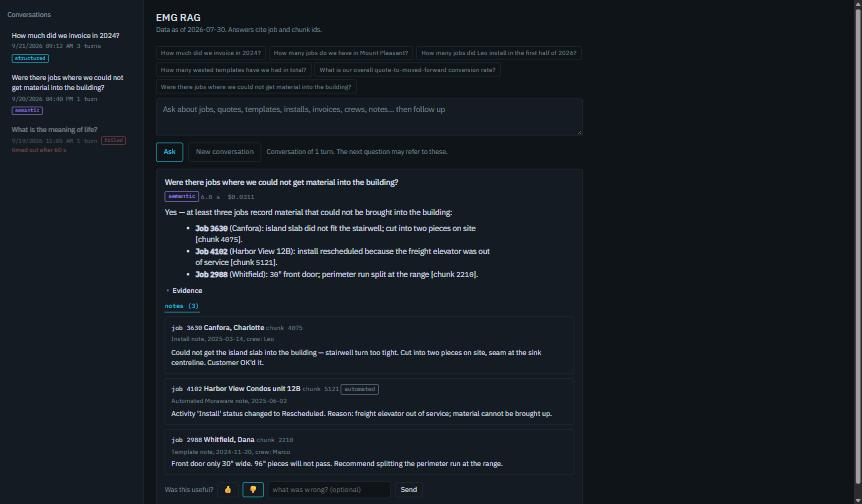 |
| Refuse, then a failed turn | not captured | 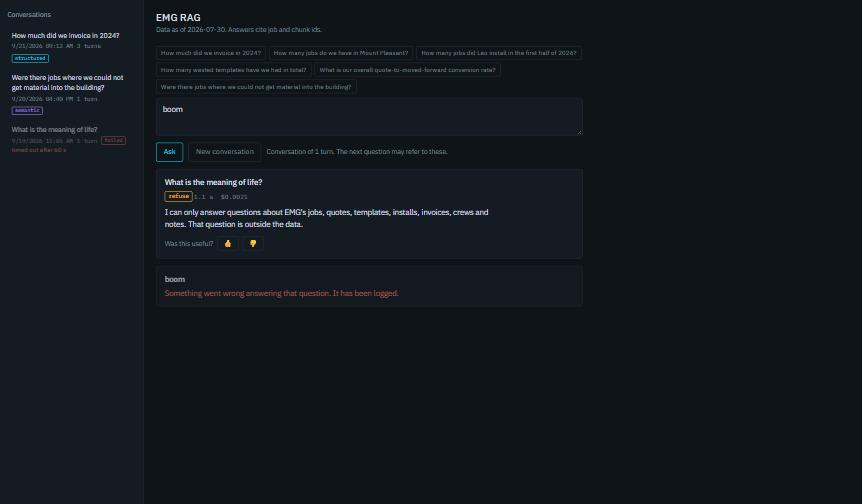 |
| Follow-up with "Interpreted as … Rephrase" | not captured | 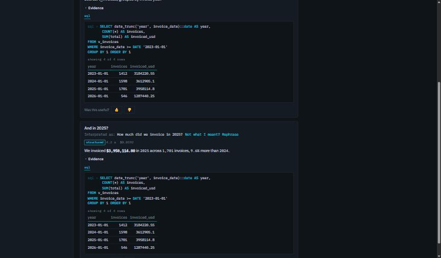 |
| 429, timeout and 500-character messages | not captured | 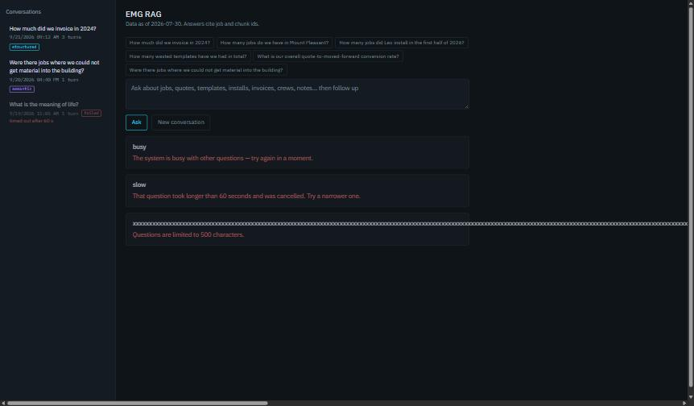 |
| A past conversation reopened (3 turns, last failed) | not captured | 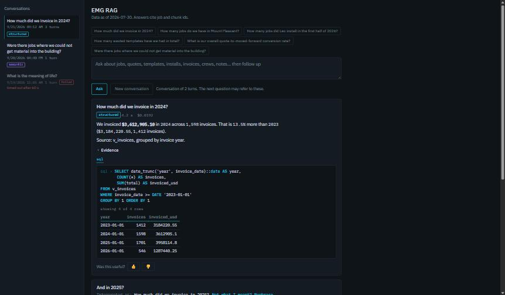 |
| Phone 380 px, idle | not captured | 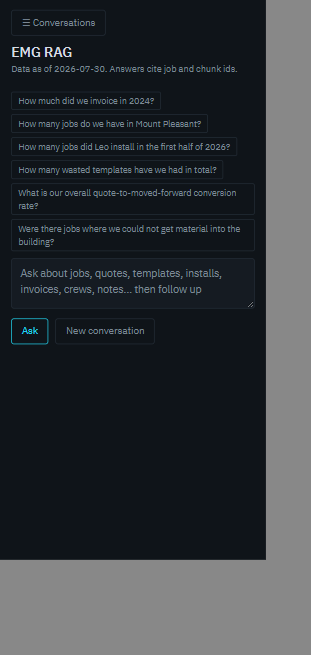 |
| Phone 380 px, drawer open | 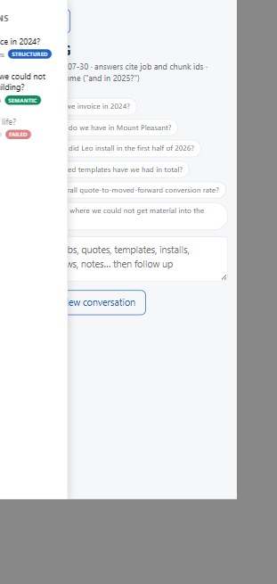 | 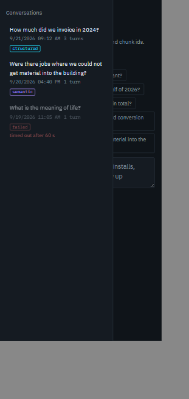 |
| Phone 380 px, a conversation open | not captured | 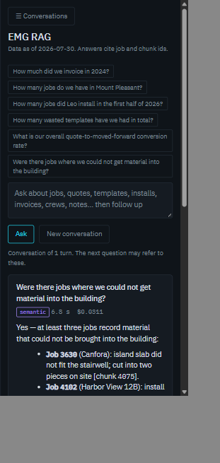 |
| Keyboard focus ring on the Ask button (Tab from the field) | not captured |  |

The "before" drawer frame caught the old 200 ms slide mid-way; that transition
no longer exists.

## 4. Behaviour regression checklist

Ticked by hand against the mock, in Chrome, on 2026-09-21. "Verified by" says
what was observed, not what the code says.

| # | Behaviour | Result | Verified by |
|---|---|---|---|
| 1 | Enter sends, Shift+Enter does not | ✅ | dispatched Shift+Enter: field stays enabled, text intact; plain Enter: field disabled, counter shown, answer landed |
| 2 | Seconds counter while in flight | ✅ | "working… 4 s" at 3 s into an 8 s mock answer; read 7 at landing; mono, `--text-dim` |
| 3 | Route badge, latency, cost on the card | ✅ | `structured  4.2 s  $0.0192` in mono under the question; badge colour = accent for structured |
| 4 | Evidence with SQL + rows | ✅ | terminal block, 4 rows, numeric columns right-aligned, "showing 4 of 4 rows" |
| 5 | Evidence notes with `automated` tag; tab switching | ✅ | hybrid answer: `sql*` / `notes (2)`; clicking notes hides the sql pane and shows the notes pane; the Harbor View note carries the tag |
| 6 | Thumbs-down opens the comment box | ✅ | 👎 click: comment input and Send appear, input focused; 👍 path unchanged |
| 7 | "Interpreted as … / Not what I meant? Rephrase" copies the text | ✅ | follow-up "And in 2025?" → "Interpreted as: How much did we invoice in 2025?"; Rephrase put that text in the field and focused it |
| 8 | "New conversation" resets | ✅ | 0 cards, no selected sidebar item, note hidden, field empty |
| 9 | Opening a past conversation shows all turns | ✅ | 3 cards (two answered, the follow-up with its interpreted line, one failed greyed with its error); note reads "Conversation of 2 turns." as before (failed turns do not count) |
| 10 | "Load more" | ✅ | hidden with 3 conversations (< 50); `loadHistory(true)` on an empty next page keeps it hidden; the 50-item logic is untouched (mock cannot supply 50) |
| 11 | 500-character cap, 429, timeout messages | ✅ | 501 × "x" → "Questions are limited to 500 characters."; busy → "The system is busy…"; slow → "That question took longer than 60 seconds…"; each as a greyed failed card in `--danger` |
| 12 | Refuse | ✅ | amber `refuse` tag, answer text, no evidence section |
| 13 | Failed turns greyed with the error | ✅ | `card failed` at 70 % opacity, error in `--danger`; sidebar item at 55 % as before |
| 14 | Phone drawer opens and closes | ✅ | at 380 px the grid is one column, the button shows, open/close by the button, and picking a conversation closes it; `scrollWidth` 380 (no horizontal scroll) |

## 5. Quality floor

- **Focus rings:** `:focus-visible { outline: 2px solid var(--accent); outline-offset: 2px }` on every focusable element; the question field swaps its border to the accent on focus instead (no double ring). Verified by tabbing from the field to the Ask button: see section 9 for what the extension could and could not simulate.
- **Contrast:** the table in section 1.1 was computed before the edit and the values did not change. Lowest text pairing is `--text-dim` on `--bg-raised` at 4.79:1. `--accent-dim` (3.5:1) carries no text: it is the `sql ›` glyph, which is hidden from assistive tech with the `content: "sql › " / ""` form.
- **Phone width:** 380 px verified (row 14). Cards, the terminal block and the rows table scroll horizontally inside themselves when the SQL or table is wider than the column; the page itself does not.
- **Dark only:** `color-scheme: dark` on `:root` and in a meta tag; form controls and scrollbars render dark; no light-mode media query.
- **Reduced motion:** `prefers-reduced-motion: reduce` removes the card fade and hides the seconds (the word "working…" stays).
- **Not fixed, pre-existing:** the example chips are `span`s without `tabindex`, so they were never keyboard-reachable. Changing that is a behaviour change and was left alone.

## 6. Font licence

IBM Plex Sans and IBM Plex Mono are © 2017 IBM Corp., reserved font name
"Plex", licensed under the SIL Open Font License 1.1. The OFL allows bundling
and self-hosting with software, forbids selling the fonts on their own, and
asks that the licence travel with the files. `serve/static/fonts/LICENSE.txt`
is IBM's licence file as shipped in both npm packages (the two copies are
byte-identical, md5 `4d4949dda4b23922e334f0cbf6179065`). The files are the
packages' own `split/woff2/*-Latin1.woff2` subsets, unmodified.

Glyph coverage was checked in the browser with `document.fonts.check` for every
non-ASCII character the page emits (— … › “ ” ñ, the ellipsis in the
placeholder, the em dash in "thanks — recorded"): all present in both faces.

## 7. Page weight, before and after

| | HTML | Fonts | First load | Repeat load |
|---|---|---|---|---|
| Before (`2b9c5fb`) | 17,452 B (17.0 KB) | 0 | 17.0 KB | 17.0 KB |
| After | 21,214 B (20.7 KB) | 78,356 B (76.5 KB) in 4 files | 97.2 KB | 20.7 KB |

The fonts are served with ETag and Last-Modified by `StaticFiles`, so a repeat
visit revalidates them with 304s. The complete (non-subset) Plex files would
have been 229 KB; the Latin-1 subsets were chosen because the page's own text
fits inside them (section 6) and the fallback stack covers anything else.

## 8. Got worse

- **First load is 5.7× heavier** (17 KB → 97 KB) because of the four font
  files. Cached afterwards. This is the cost of the direction, not a defect.
- **Structured and hybrid cards are roughly three times taller** now that the
  evidence opens by default; a long conversation needs more scrolling. Chosen
  on purpose; the summary still collapses it per card.
- **Numbers in prose go mono by pattern, not by provenance.** The page cannot
  know which digits came from the rows, so every digit run in the answer (years,
  chunk ids, percentages, money) takes the mono face. Digit runs glued to a
  letter ("12B") stay in Sans.
- **Non-Latin-1 text falls back mid-word** to the system font (Cyrillic, Greek,
  Vietnamese in a job name, for example). Nothing in the current data was
  checked for this; the complete Plex files would fix it at +150 KB.
- **One Python file changed** although the order said "no API changes": the
  static mount is the minimum needed to serve the fonts without a CDN.
- **Small wording changes** a user might notice: the header line lost its
  "follow-ups welcome" hint (the direction gave the exact sentence); the
  conversation note is now a sentence; tab labels read `sql` / `notes (n)`;
  the sidebar heading is "Conversations". No control moved.
- Nothing got slower: no runtime code path changed, and no pipeline call was
  made.

## 9. Surprises

- **The server has no browser and 193 MB free**, so "headless Chromium on the
  server" was never an option. The screenshots came from local Chrome against
  a 150-line stdlib mock of the five endpoints (scratchpad only, not
  committed). That turned out better than the real service: a 429 needs two
  questions in flight, a 504 needs a 60 s hang, and a 500 needs a broken
  pipeline. The mock reaches every one of those by question text.
- **The old page had four motions, not two.** Nobody listed the spinning ring
  or the drawer slide. Both were removed so "exactly two" is true.
- **Resizing the Chrome window through the extension did not resize the
  viewport** (`innerWidth` stayed at 1680), so the 380 px check runs the page
  inside a same-origin iframe served by the mock. The media query, the drawer
  and `scrollWidth` were all read from inside that frame.
- **Synthetic Tab keypresses from the extension do not move focus** the way a
  physical key does, so the focus ring was verified by clicking into the field
  and tabbing once to the Ask button and reading `:focus-visible` and the
  computed outline off the active element (section 5).
- **A 501-character question overflowed the card sideways.** The old page did
  the same. `overflow-wrap: anywhere` on the question line fixes it; the cap
  message itself was correct.
- **`&#39;`** in escaped text contains digits; the number regex has a
  lookbehind for `#` and `&` so entities are never split.
- **Plex Mono Medium reports "unloaded"** until a rows table is on the page;
  `font-display: swap` fetches it lazily. Harmless.
- At the start of the session `evals/results/2026-09-14-0920-wo11.md` was
  found overwritten with seven bytes of stray keystrokes (04:04 today); it was
  restored from git before any WO18 work. Unrelated to this order.

## 10. Cost

$0 in API calls. The pipeline was never invoked: every state came from the
mock. Server-side in-process check (`TestClient` on `/` and one font file) is
recorded in section 11 after the push.

## 11. In-process check on the server

Run on the server at `a158fd9` after the cron pull (2026-09-21 08:37 UTC),
with the project venv and Starlette's `TestClient`, without touching the
running service:

| Request | Result |
|---|---|
| `GET /` | 200, `text/html; charset=utf-8`, 21,214 bytes, contains the Plex `@font-face` rules |
| `GET /static/fonts/IBMPlexMono-Regular-Latin1.woff2` | 200, `font/woff2`, 17,544 bytes, ETag present |
| same with `If-None-Match` | 304 |
| `GET /static/fonts/../app.py` | 404 (no traversal) |
| `GET /static/index.html` | 404 (only the fonts directory is mounted) |

Free memory on the box during the check: 194 MB free, 1,002 MB available; the
WhatsApp containers were not touched. The running service still serves the
WO16 page until `systemctl restart emg-rag-api` (Alex).
